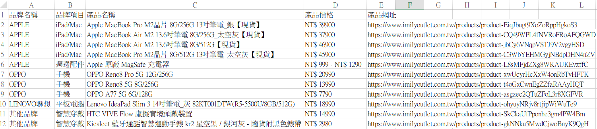
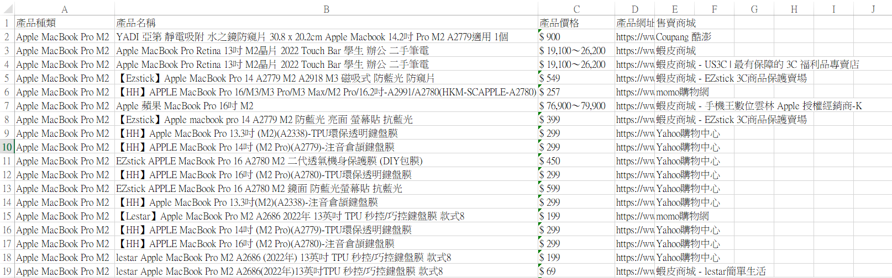
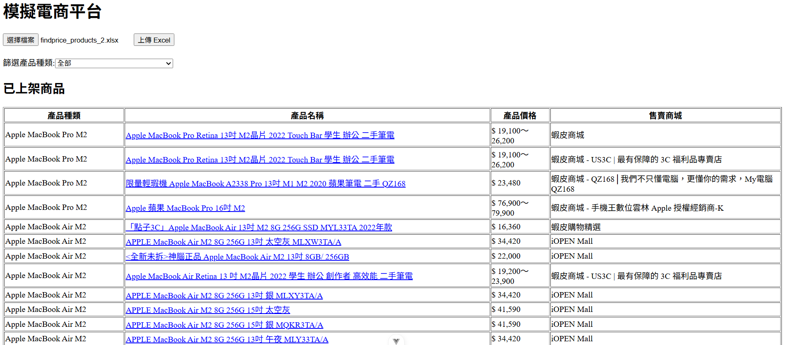
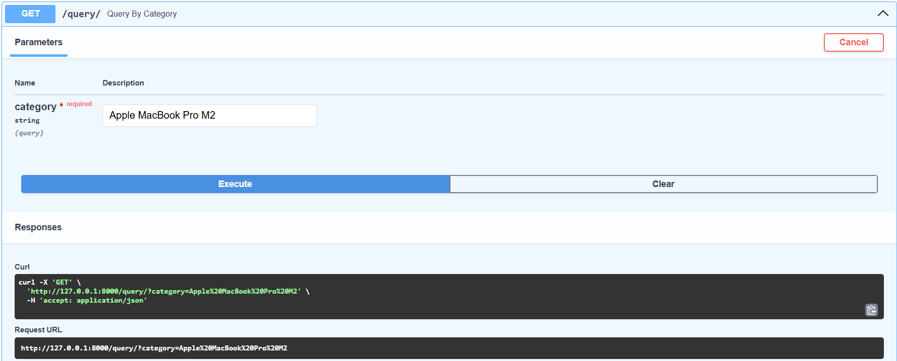
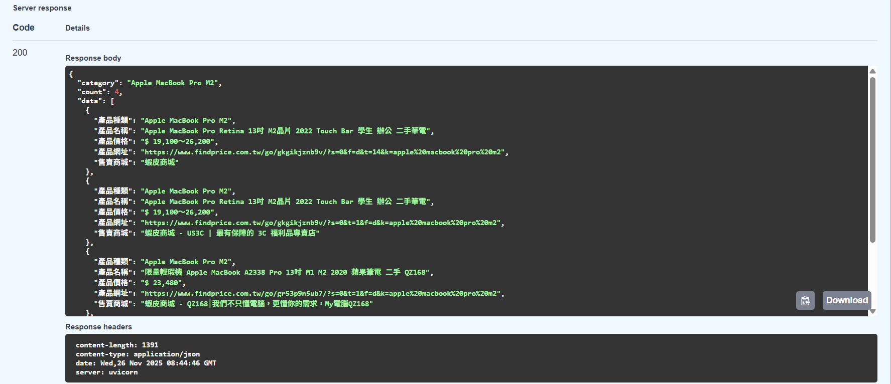

## 模擬電商上架流程
- 整合 Selenium 爬蟲，自動取得商品資訊並匯出到 Excel
  - 以"愛美麗福利社"的"通訊產品"為目標商品
    
  - 查詢 findprice 網站相同的商品
    
- 前端匯入 Excel 商品資料並顯示
  - 
- 後端提供查詢 API、篩選商品資料
  - 
  - 

## 專案架構
```
auto-EC-process/
├─ backend/
│  └─ main.py
├─ frontend/
│  ├─ src/components/
│  │  └─ ProductUploader.vue
│  ├─ main.js
│  └─ App.vue
├─ crawler/
│  ├─ imily_crawler.py
│  ├─ findprice_crawler.py
│  ├─ imily_products.xlsx
│  ├─ findprice_products.xlsx
│  └─ findprice_products_2.xlsx
└─ README.md
```

## 參考資料
- [105學年度產業實習報告/俞詠涵/真理大學/工業管理與經營資訊學系](https://imei.au.edu.tw/var/file/45/1045/img/2788/68147982.pdf)
